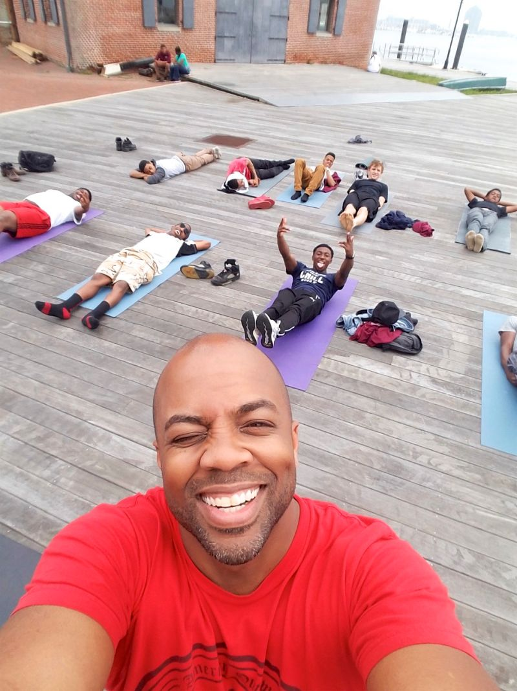

![##**BIO**##]

https://github.com/kharris157/kharris157.github.io/blob/master/yoga.jpg

### A small fact about yoga is it can also be great for fitness. It builds muscle strenghth, protecting from conditions like arthritis and back pain. When building strength through yoga, you balance it with flexibility. 

### Yoga’s incorporation of meditation and breathing can help improve a person’s mental well-being. Regular yoga practice creates mental clarity and calmness; increases body awareness; relieves chronic stress patterns; relaxes the mind; centers attention; perfects posture; boost immune system; and lowers blood sugar and blood pressure just to name a few. 

### I know we've all heard of the sterotype that yoga is only for women but in all honesty more men are practicing yoga in the 21st century at an increasing rate. Id like to think its mainly because men are able to show a more sensitive side without much judgement now than ten years ago along with couples yoga as a main highlight. (Please have a click on the video below to see example of couples yoga)

